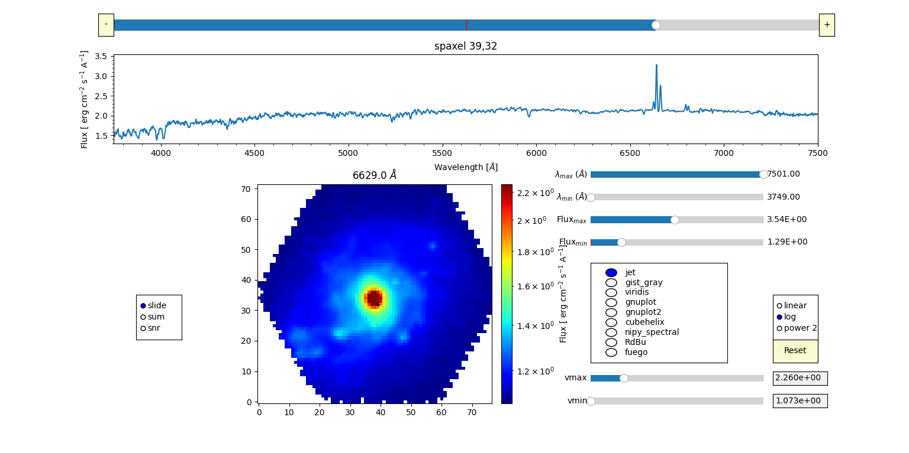

<div id="top"></div>

[![Contributors][contributors-shield]][contributors-url]
[![Forks][forks-shield]][forks-url]
[![Stargazers][stars-shield]][stars-url]
[![Issues][issues-shield]][issues-url]
[![GNU License][license-shield]][license-url]
[![LinkedIn][linkedin-shield]][linkedin-url]


<h3 align="center">PyIFSview</h3>

  <p align="center">
    PyIFSview is a tool developed to interactively visualize integral field spectroscopy (IFS) data,  such as CALIFA, MaNGA, SAMI or MUSE data.
</a>.
    <br />
    <a href="https://github.com/imoralc/PyIFSview#usage">View Demo</a>
    ·
    <a href="https://github.com/imoralc/PyIFSview/issues">Report Bug</a>
    ·
    <a href="https://github.com/imoralc/PyIFSview/issues">Request Feature</a>
  </p>
</div>

<!-- TABLE OF CONTENTS -->
<details>
  <summary>Table of Contents</summary>
  <ol>
    <li>
      <a href="#about-the-project">About The Method</a>
    </li>
    <li>
      <a href="#getting-started">Getting Started</a>
      <ul>
        <li><a href="#prerequisites">Prerequisites</a></li>
        <li><a href="#installation">Installation</a></li>
      </ul>
    </li>
    <li><a href="#usage">Usage</a></li>
    <li><a href="#results">Results</a></li>
    <li><a href="#contributing">Contributing</a></li>
    <li><a href="#license">License</a></li>
    <li><a href="#contact">Contact</a></li>
    <li><a href="#cite">Cite</a></li>
    <!-- <li><a href="#acknowledgments">Acknowledgments</a></li> -->
  </ol>
</details>

## Getting Started:

We try to make the usage of PyIFSview as simple as possible. For that purpose, we have create a PyPI package to install PyIFSview.

#### Prerequisites:

- `Numpy`: Python library used for working with arrays
- `Matplotlib`: Python 2D plotting library
- `Astropy`: astronomy library

## Installation:

Using pip you can either install the last relase by

```sh
  pip install PyIFSview
```

or you can install the latest version of the code as 

```sh
  git clone git@github.com:imoralc/PyIFSview.git
  cd PyIFSview
  pip install -e .
```

<p align="right">(<a href="#top">back to top</a>)</p>


<!-- USAGE EXAMPLES -->

## Usage:

In here we show how to use PyIFSview for a IFS datacube (three dimensional)
First of all we have to import our library previously install

```python
    from PyIFSview import PyIFSview
```

Then we read the [CALIFA datacube]([https://github.com/PabloMSanAla/fabada/blob/master/examples/bubble.png](https://github.com/imoralc/PyIFSview/blob/main/NGC2253.fits.gz)) borrowed from the [CALIFA Legacy Survey](https://califa.caha.es/).

```python
    PyIFSview(cube_fits_file = 'NGC2253.fits.gz')
```

And its done :wink:
It is as easy as one line of code.

The results obtained running this example would be:



Screenshot of the code using data from the CALIFA Survey. The spectrum and the slide can be changed just by clicking on any spaxel in the slide plot and moving the horizontal line in the spectrum plot to select any wavelength, respectively. Additionally, the colormap or the scale can be also changed interactively just by clicking on any of the list. It can work with any colormap included in Matplotlib or designed by the user.

- `cube_fits_file`: Path and name of the IFS datacube to read
- `origin_cube`: str optional. This keyword allow us to indicate the origin of the data.

  Possible options: CALIFA, MUSE, MaNGA, SAMI, KOALA or CAVITY
- `slide`: float optional.
- `f_min` and `f_max`: float optional. Flux limits of the spectrum's plot.
- `l_min` and `l_max`: float optional. Wavelenght limits to show the spectrum
- `c_min` and `c_max`: float optional. Flux limits of the imshow's plot.
- `x0` and `y0`: int optional. Coordinates of the spectrum to show.
- `snr_lmax` and `snr_lmin`: float optional. Wavelenght limits to compute the S/N


<p align="right">(<a href="#top">back to top</a>)</p>


<!-- CONTRIBUTING -->

## Contributing

Contributions are what make the open source community such an amazing place to learn, inspire, and create. Any contributions you make are **greatly appreciated**. ❤️❤️

If you have a suggestion that would make this better, please fork the repo and create a pull request. You can also simply open an issue with the tag "enhancement".
Don't forget to give the project a star! Thanks again!

1. Fork the Project
2. Create your Feature Branch (`git checkout -b feature/AmazingFeature`)
3. Commit your Changes (`git commit -m 'Add some AmazingFeature'`)
4. Push to the Branch (`git push origin feature/AmazingFeature`)
5. Open a Pull Request

<p align="right">(<a href="#top">back to top</a>)</p>

Please try to create reports that are:


**Reproducible:** Include steps to reproduce the problem.  
**Specific:** Include as much detail as possible: which version, what environment, etc.  
**Unique:** Do not duplicate existing opened issues.  
**Scoped to a single bug:** One bug per report.  


<!-- LICENSE -->

## License

Distributed under the GNU General Public License. See [`LICENSE.txt`](https://github.com/imoralc/PyIFSview/blob/master/LICENSE) for more information.

<p align="right">(<a href="#top">back to top</a>)</p>

<!-- CONTACT -->

## Contact

Ignacio del Moral Castro - ignaciodelmoralcastro@gmail.com

Project Link: [https://github.com/imoralc/PyIFSview](https://github.com/imoralc/PyIFSview)

<p align="right">(<a href="#top">back to top</a>)</p>


<!-- MARKDOWN LINKS & IMAGES -->
<!-- https://www.markdownguide.org/basic-syntax/#reference-style-links -->

[contributors-shield]: https://img.shields.io/github/contributors/imoralc/PyIFSview.svg?style=plastic&logo=appveyor
[contributors-url]: https://github.com/imoralc/PyIFSview/graphs/contributors
[forks-shield]: https://img.shields.io/github/forks/imoralc/PyIFSview.svg?style=plastic&logo=appveyor
[forks-url]: https://github.com/imoralc/PyIFSview/network/members
[stars-shield]: https://img.shields.io/github/stars/imoralc/PyIFSview.svg?style=plastic&logo=appveyor
[stars-url]: https://github.com/imoralc/PyIFSview/stargazers
[issues-shield]: https://img.shields.io/github/issues/imoralc/PyIFSviewsvg?style=plastic&logo=appveyor
[issues-url]: https://github.com/imoralc/PyIFSview/issues
[license-shield]: https://img.shields.io/github/license/imoralc/PyIFSview.svg?style=plastic&logo=appveyor
[license-url]: https://github.com/imoralc/PyIFSview/blob/main/LICENSE
[linkedin-shield]: https://img.shields.io/badge/-LinkedIn-black.svg?style=plastic&logo=linkedin&colorB=555
[linkedin-url]: https://www.linkedin.com/in/ignacio-del-moral-castro-0a139698/
