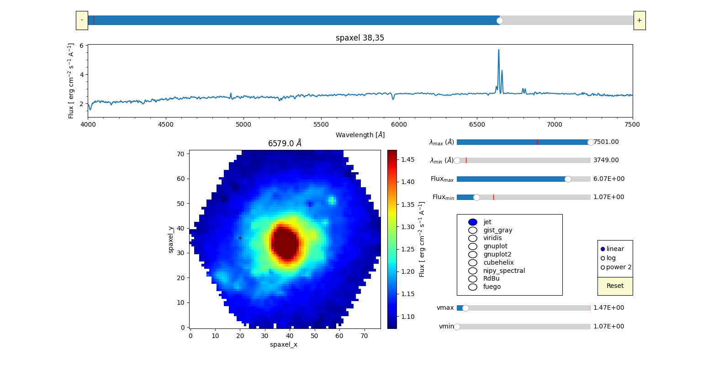

# PyIFSview
Simple python tool developed to interactively visualize integral field spectroscopy (IFS) data,  such as CALIFA, MaNGA, SAMI or MUSE data.

## Installation:
No installation is necessary. Only copy the files  and run it to visualize the desired datacube.

## Software Requirements:

-) Numpy: Python library used for working with arrays
-) Matplotlib: Python 2D plotting library
-) Astropy: astronomy library

## Examples:

- Screenshot of the code using data from the CALIFA Survey. The spectrum and the slide can be changed just by clicking on any spaxel in the slide plot and moving the horizontal line in the spectrum plot to select any wavelength, respectively. Additionally, the colormap can be also changed interactively just by clicking on any of the list. It can work with any colormap included in Matplotlib or designed by the user.

